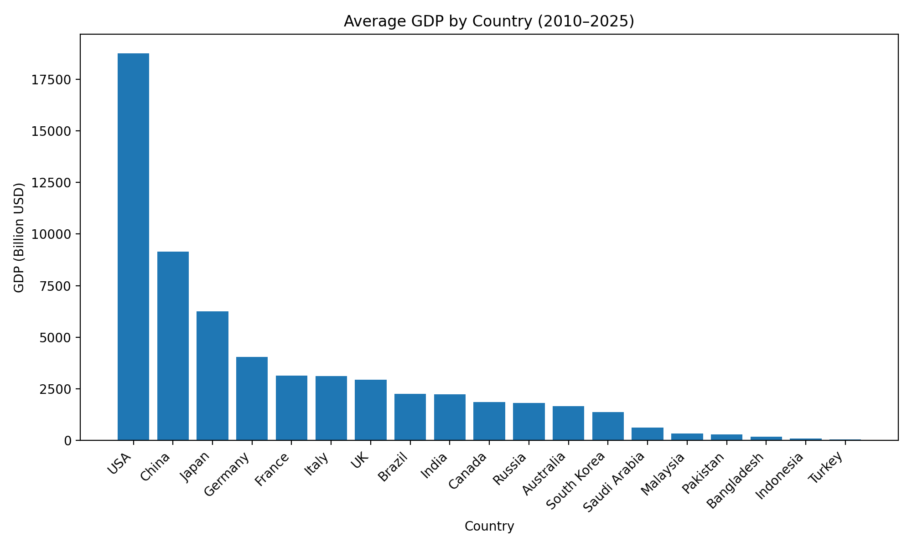
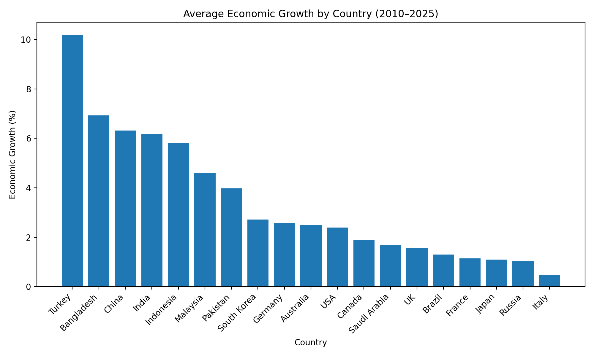
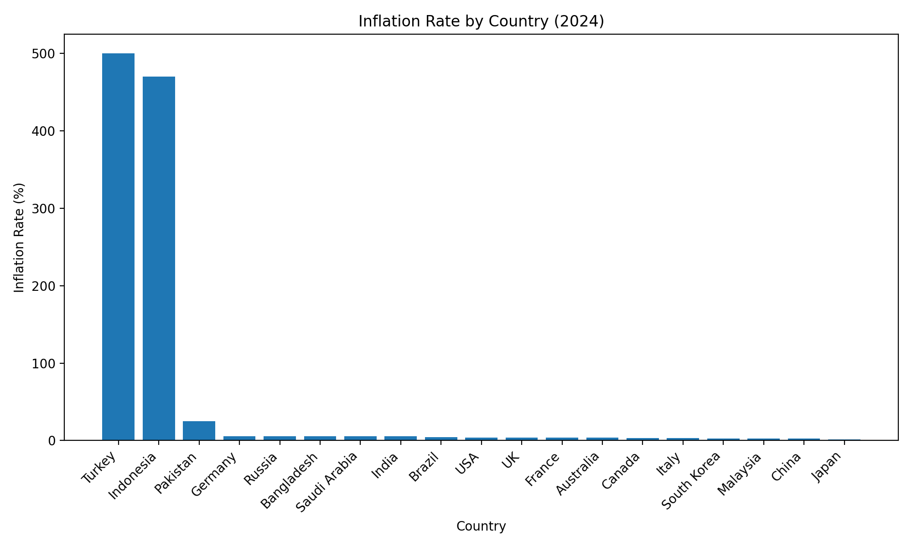
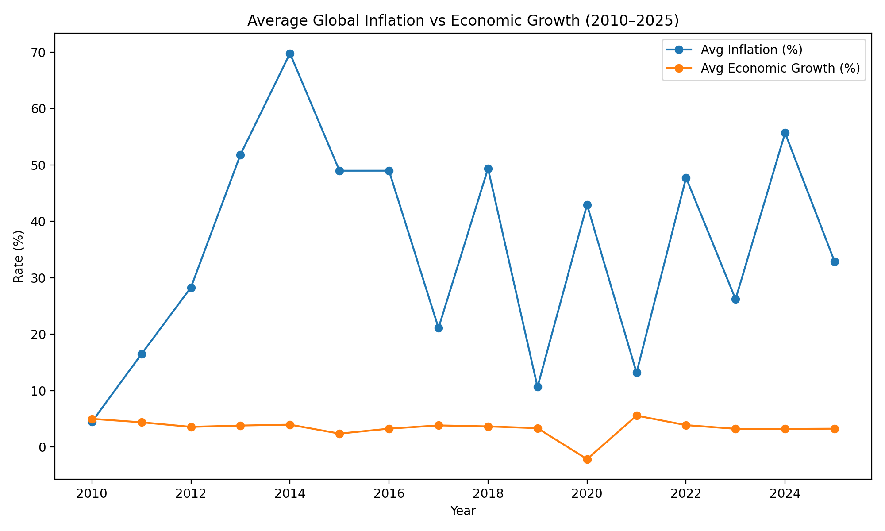
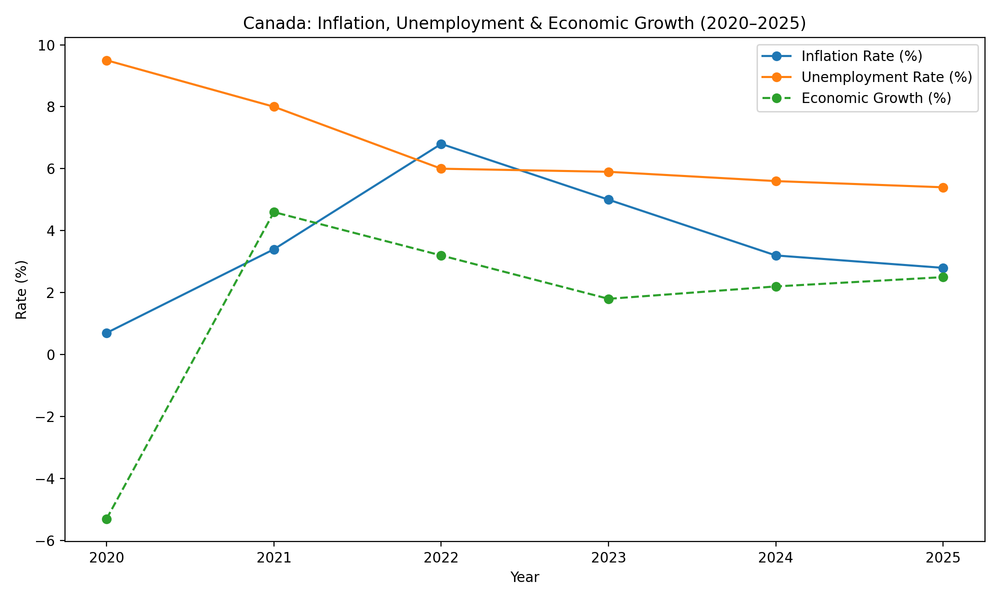

# Economic Indicators & Inflation Analysis (2010–2025)

## Objective
This project analyzes global economic indicators — GDP, inflation,
unemployment, and economic growth — to identify long-term trends
and relationships across developed and emerging economies.

## Dataset
- Source: Kaggle – Economic Indicators & Inflation Data  
- Coverage: 2010–2025  
- Countries: 19  

## Tools Used
- Python
- Pandas
- Matplotlib
- Jupyter Notebook

## Key Questions
- How do GDP levels compare across countries?
- Which countries show stronger long-term economic growth?
- How does inflation differ across economies in 2024?
- What is the relationship between inflation and economic growth over time?
- How did Canada’s economy evolve after 2020?

## Key Insights
- Emerging economies show higher growth but greater volatility.
- High inflation is associated with slower economic growth.
- Developed economies tend to have lower but more stable growth.
- Canada experienced post-pandemic recovery with declining unemployment
  and moderating inflation after 2022.

## Executive Summary (PDF)
A concise presentation highlighting key findings and insights.

[View executive summary](report/economic_indicators_inflation_summary.pdf)

## Visualizations

### Average GDP by Country (2010–2025)

### Average Economic Growth by Country (2010–2025)

### Inflation Rate by Country (2024)

### Global Inflation vs Economic Growth (2010–2025)

### Canada: Inflation, Unemployment & Economic Growth (2020–2025)

## Project Structure
economic-indicators-and-inflation/
├── data/
├── notebooks/
├── outputs/
│   └── figures/
└── README.md
